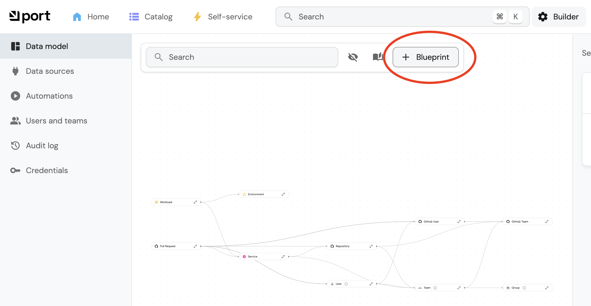

# Workshop Prep

## Import the blueprints

Go to the Builder and click the `+ Blueprint` button :  



Then click the `{...} Edit JSON` button : 


Paste this json content : 

```
{
    "identifier": "rt_appben_retail_apps",
    "description": "Captures essential info about retail applications and services, including both external and internal apps supporting business operations.",
    "title": "Retail Applications",
    "icon": "Microservice",
    "schema": {
      "properties": {
        "applicationid": {
          "type": "string",
          "title": "ID",
          "icon": "Organization"
        },
        "name": {
          "type": "string",
          "title": "Name",
          "icon": "Organization"
        },
        "applicationshortcode": {
          "type": "string",
          "title": "Short Code",
          "icon": "Organization"
        },
        "productowner": {
          "icon": "Organization",
          "type": "string",
          "title": "Product Owner",
          "format": "user"
        },
        "scrummaster": {
          "icon": "Organization",
          "type": "string",
          "title": "Scrum Master",
          "format": "user"
        },
        "testlead": {
          "icon": "Organization",
          "type": "string",
          "title": "Test Lead",
          "format": "user"
        },
        "releasemanager": {
          "icon": "Organization",
          "type": "string",
          "title": "Release Manager",
          "format": "user"
        },
        "costcentre": {
          "type": "string",
          "title": "Cost Centre",
          "icon": "Organization"
        },
        "applicationsupportgroup": {
          "type": "string",
          "title": "Application Support Group",
          "icon": "Organization"
        },
        "infrastructuresupportgroup": {
          "type": "string",
          "title": "Infrastructure Support Group",
          "icon": "Organization"
        },
        "department": {
          "title": "Department",
          "icon": "Organization",
          "type": "string",
          "enum": [
            "RP",
            "GP",
            "IT",
            "DO"
          ],
          "enumColors": {
            "RP": "lightGray",
            "GP": "lightGray",
            "IT": "lightGray",
            "DO": "lightGray"
          }
        },
        "appnumber": {
          "type": "string",
          "title": "App Number",
          "icon": "Organization"
        },
        "lean_ix_id": {
          "type": "string",
          "title": "LeanIX ID",
          "icon": "Microservices"
        },
        "apptio_id": {
          "type": "string",
          "title": "Apptio ID",
          "icon": "AppRunner"
        }
      },
      "required": [
        "name",
        "applicationshortcode"
      ]
    },
    "mirrorProperties": {},
    "calculationProperties": {},
    "aggregationProperties": {},
    "relations": {
      "lg_shared_bu": {
        "title": "Business Unit",
        "target": "group",
        "required": false,
        "many": false
      }
    }
  }
  ```

Repeat the same process for this blueprint : 

```
{
    "identifier": "rt_appben_firewall_rules",
    "description": "Captures and displays essential information about firewall rules controlling network traffic between applications.",
    "title": "Firewall Rules",
    "icon": "FireHydrant",
    "schema": {
      "properties": {
        "source_ip_address": {
          "icon": "FireHydrant",
          "type": "string",
          "title": "Source IP Address"
        },
        "application": {
          "icon": "FireHydrant",
          "title": "Application",
          "type": "string"
        },
        "source_cidr_notation": {
          "icon": "FireHydrant",
          "title": "Source CIDR Notation",
          "type": "string"
        },
        "source_port": {
          "icon": "FireHydrant",
          "title": "Source Port",
          "type": "string"
        },
        "other_source_port": {
          "icon": "FireHydrant",
          "type": "string",
          "title": "Other Source Port"
        },
        "destination_ip_address": {
          "icon": "FireHydrant",
          "type": "string",
          "title": "Destination IP Address"
        },
        "destination_cidr_notation": {
          "icon": "FireHydrant",
          "title": "Destination CIDR Notation",
          "type": "string"
        },
        "destination_port": {
          "icon": "FireHydrant",
          "title": "Destination Port",
          "type": "string"
        },
        "other_destination_port": {
          "icon": "FireHydrant",
          "type": "string",
          "title": "Other Destination Port"
        },
        "environment": {
          "icon": "FireHydrant",
          "title": "Environment",
          "type": "string"
        },
        "dr_source_ip_address": {
          "icon": "FireHydrant",
          "type": "string",
          "title": "DR Source IP Address"
        },
        "dr_destination_ip_address": {
          "icon": "FireHydrant",
          "type": "string",
          "title": "DR Destination IP Address"
        },
        "status": {
          "type": "string",
          "title": "Request Status",
          "icon": "StatusPage",
          "default": "Pending",
          "enum": [
            "Awaiting Testing",
            "Completed",
            "Tests Failed",
            "Pending",
            "Pending implementation",
            "Auto Applied",
            "Processing",
            "Pending Approval"
          ],
          "enumColors": {
            "Awaiting Testing": "blue",
            "Completed": "green",
            "Tests Failed": "red",
            "Pending": "yellow",
            "Pending implementation": "yellow",
            "Auto Applied": "green",
            "Processing": "yellow",
            "Pending Approval": "yellow"
          }
        },
        "infosec_approval": {
          "title": "InfoSec Approval",
          "icon": "StatusPage",
          "type": "string",
          "default": "Pending Approval",
          "enum": [
            "Pending Approval",
            "Approved",
            "Auto Approved",
            "Rejected"
          ],
          "enumColors": {
            "Pending Approval": "yellow",
            "Approved": "green",
            "Auto Approved": "green",
            "Rejected": "red"
          }
        },
        "network_approval": {
          "type": "string",
          "title": "Network Team Approval",
          "icon": "StatusPage",
          "default": "Pending Approval",
          "enum": [
            "Pending Approval",
            "Approved",
            "Auto Approved",
            "Rejected"
          ],
          "enumColors": {
            "Pending Approval": "yellow",
            "Approved": "green",
            "Auto Approved": "green",
            "Rejected": "red"
          }
        },
        "architecture_approval": {
          "title": "Architecture Approval",
          "icon": "StatusPage",
          "type": "string",
          "default": "Pending Approval",
          "enum": [
            "Pending Approval",
            "Approved",
            "Auto Approved",
            "Rejected"
          ],
          "enumColors": {
            "Pending Approval": "yellow",
            "Approved": "green",
            "Auto Approved": "green",
            "Rejected": "red"
          }
        },
        "action": {
          "type": "string",
          "title": "Action",
          "icon": "FireHydrant",
          "default": "Allow",
          "enum": [
            "Allow",
            "Block"
          ],
          "enumColors": {
            "Allow": "green",
            "Block": "red"
          }
        },
        "source_domain": {
          "icon": "FireHydrant",
          "title": "Source Domain",
          "type": "string"
        },
        "destination_domain": {
          "icon": "FireHydrant",
          "title": "Destination Domain",
          "type": "string"
        },
        "requester": {
          "type": "string",
          "title": "Requester",
          "icon": "User",
          "format": "user"
        }
      },
      "required": []
    },
    "mirrorProperties": {},
    "calculationProperties": {},
    "aggregationProperties": {},
    "relations": {
      "rt_appben_retail_apps": {
        "title": "Retail Application",
        "target": "rt_appben_retail_apps",
        "required": true,
        "many": false
      }
    }
  }
  ```

  And now let's add to sample entities, go to "Catalog" and select "Retail Applications"  : 

  

