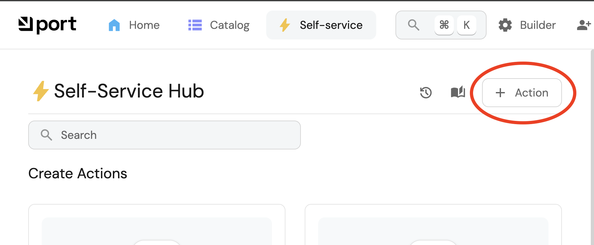

# Introduction

You will now create your first Self-Service Action (SSA) ! Go to "Self-Service" and click the `+Action` button : 



Then go to edit JSON mode and paste the following content : 

```
{
  "identifier": "create_firewall_rule",
  "title": "Create Firewall Rule",
  "icon": "FireHydrant",
  "trigger": {
    "type": "self-service",
    "operation": "CREATE",
    "userInputs": {
      "properties": {
        "source_ip_address": {
          "icon": "FireHydrant",
          "type": "string",
          "title": "Source IP Address"
        },
        "application": {
          "icon": "FireHydrant",
          "title": "Application",
          "type": "string"
        },
        "source_cidr_notation": {
          "icon": "FireHydrant",
          "title": "Source CIDR Notation",
          "type": "string"
        },
        "source_port": {
          "icon": "FireHydrant",
          "title": "Source Port",
          "type": "string"
        },
        "other_source_port": {
          "icon": "FireHydrant",
          "type": "string",
          "title": "Other Source Port"
        },
        "destination_ip_address": {
          "icon": "FireHydrant",
          "type": "string",
          "title": "Destination IP Address"
        },
        "destination_cidr_notation": {
          "icon": "FireHydrant",
          "title": "Destination CIDR Notation",
          "type": "string"
        },
        "destination_port": {
          "icon": "FireHydrant",
          "title": "Destination Port",
          "type": "string"
        },
        "other_destination_port": {
          "icon": "FireHydrant",
          "type": "string",
          "title": "Other Destination Port"
        },
        "environment": {
          "icon": "FireHydrant",
          "title": "Environment",
          "type": "string"
        },
        "dr_source_ip_address": {
          "icon": "FireHydrant",
          "type": "string",
          "title": "DR Source IP Address"
        },
        "dr_destination_ip_address": {
          "icon": "FireHydrant",
          "type": "string",
          "title": "DR Destination IP Address"
        },
        "action": {
          "type": "string",
          "title": "Action",
          "icon": "FireHydrant",
          "default": "Allow",
          "enum": [
            "Allow",
            "Block"
          ],
          "enumColors": {
            "Allow": "green",
            "Block": "red"
          }
        },
        "source_domain": {
          "icon": "FireHydrant",
          "title": "Source Domain",
          "type": "string"
        },
        "destination_domain": {
          "icon": "FireHydrant",
          "title": "Destination Domain",
          "type": "string"
        }
      },
      "required": [],
      "order": []
    },
    "blueprintIdentifier": "rt_appben_firewall_rules"
  },
  "invocationMethod": {
    "type": "WEBHOOK",
    "url": "https://example.com",
    "agent": false,
    "synchronized": false,
    "method": "POST",
    "headers": {
      "RUN_ID": "{{ .run.id }}"
    },
    "body": {
      "{{ spreadValue() }}": "{{ .inputs }}",
      "port_context": {
        "runId": "{{ .run.id }}",
        "blueprint": "{{ .action.blueprint }}"
      }
    }
  }
}
```

 \"{{ spreadValue() }}\": \"{{ .inputs }}\"

Look at the result, play around with the fields, try to set some defaults for instance etc ...
For now the execution of the action will fail as it's not connected to a valid backend, let's fix this now ! 
